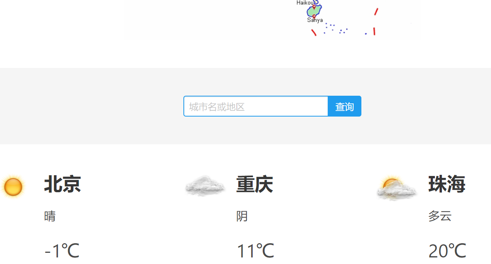

# flask_weather
flask_weather

# 前言

之前也用了django做了个类似的查询服务，好像有些杀鸡用牛刀感觉，而且在国内网络环境查询国外天气很慢，干脆就用flask重做了一个，取消了国外天气查询，而且不再使用数据库。

# 数据存储

仅使用cookies

# 查询优化

改用城市id来查询（已经做了映射，直接输入城市名即可）  
之前用城市名查询不是非常友好，查询不到就默认北京，而且这个API首推也是id查询，也提供了id的json数据。不过比直接城市名查询麻烦一点，得做一下映射。

# API
- [天气](http://www.tianqiapi.com)
感谢网站作者提供这么全面的API